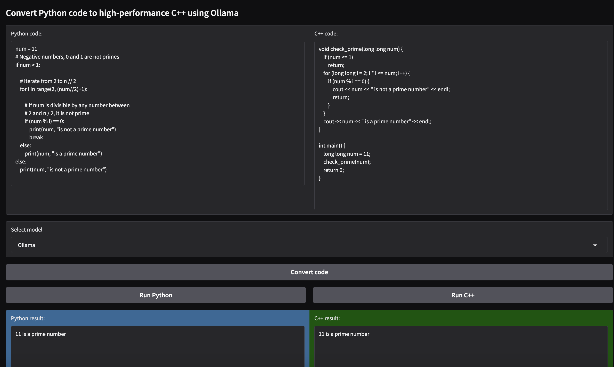

# Python to C++ Optimizer

This project converts Python code to high-performance C++ code using an Ollama model. The application is built with Gradio to provide a simple web interface for code conversion and execution.

## Features

- **Code Conversion:** Uses an Ollama model to translate Python code into optimized C++.
- **Execution Helpers:** Run Python code and compile/execute the generated C++ code.
- **User-Friendly UI:** Built with Gradio for an intuitive web interface.
- **Platform Specific:** Optimized for Apple M2 (for C++ code compilation).

## Installation and Usage

1. **Clone the Repository:**

   ```bash
   git clone https://github.com/your-username/python-to-cpp-optimizer.git
   cd python-to-cpp-optimizer
Install Dependencies:

Install the required Python packages:

bash
Copy
pip install -r requirements.txt
(If you don't have a requirements.txt, ensure you install at least gradio and python-dotenv.)

Run the Application:

bash
Copy
python your_script_name.py
This will launch the Gradio interface in your browser.

Below is a screenshot of the application UI:



Contributing
Feel free to fork this repository and submit pull requests for improvements or bug fixes.
